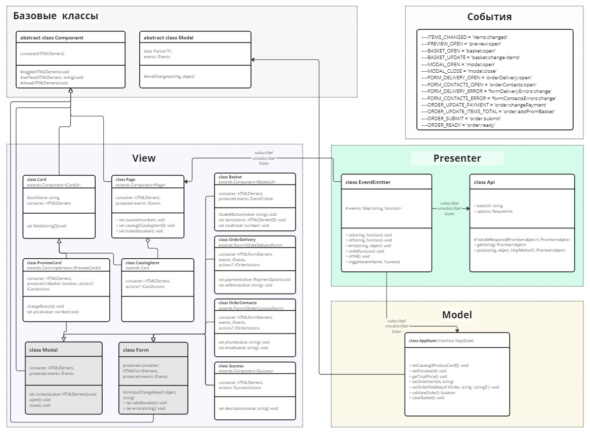

# Проектная работа "Веб-ларек"

Стек: HTML, SCSS, TS, Webpack

Структура проекта:

- src/ — исходные файлы проекта
- src/components/ — папка с JS компонентами
- src/components/base/ — папка с базовым кодом

Важные файлы:

- src/pages/index.html — HTML-файл главной страницы
- src/types/index.ts — файл с типами
- src/index.ts — точка входа приложения
- src/styles/styles.scss — корневой файл стилей
- src/utils/constants.ts — файл с константами
- src/utils/utils.ts — файл с утилитами

## Установка и запуск

Для установки и запуска проекта необходимо выполнить команды

```
npm install
npm run start
```

или

```
yarn
yarn start
```

## Сборка

```
npm run build
```

или

```
yarn build
```


Описание проекта
----------------

Приложение представляет собой интернет-магазин с товарами для веб-разработчиков — Web-ларёк. В нём можно посмотреть каталог товаров, посмотреть описание  товара в отдельном модальном окне, добавить товары в корзину и сделать заказ.

Проект содержит в себе 2 layout(экрана) в котором и происходит работа нашего приложения и его функциональных блоков:

1.  **Блок главной страницы(Page)** Содержит заголовок и галерею товаров, которая в свою очередь состоит из отдельных элементов - карточек товаров.
2.  **Блок Модальное окно(Modal)** Расположен оверлеем на главной странице. Изначально это элемент интерфейса у которого есть только кнопка закрыть.

Основные крупные функциональные блоки (отображения) из которых строится наше приложение:

1.  **Хедер с иконкой корзины** - состоит из логотипа и иконки корзины с счетчиком;
2.  **Каталог товаров** - выводит набор карточек, который мы ей передали;
3.  **Карточка товара** - содержит категорию товара, название, картинку и цену;
4.  **Карточка товара в модальном окне** - повторяет содержимое карточки товаров(c увеличенным шрифтом названия товара и картинки) + добавляется описание товара и кнопка “Купить”;
5.  **Корзина** - состоит из заголовка, списка товаров, общей суммы заказа и кнопки “Оформить”;
6.  **Элемент товара в корзине** - выводит информацию о товаре(название и стоимость) и иконку корзины, которая позволяет удалить товар из списка;
7.  **Форма доставки** - содержит 2 элемента формы(заголовок Способ оплаты с 2 вариантами на выбор и заголовок Адрес доставки с полем input type="text" ) и кнопкой “Далее”;
8.  **Форма контактных данных** - содержит 2 элемента формы с заголовками Email и Телефон, соответствующими полями input type="text" и кнопкой “Оформить”;
9.  **Блок успешного оформления заказа** - отрисовывает иконку и заголовок успешного оформления заказа, выводит информацию о списанной сумме, а также кнопку “За новыми покупками!”, ведущую на главную страницу приложения.

Данные, которые, мы используем для работы приложения и реализации его функционала;

*   **Каталог товаров,** который мы запрашиваем по api (GET на endpoint - /product/).
*   В свою очередь каталог товаров состоит из **карточек товаров**, которые включают в себя id, название товара, описание, ссылку на картинку, категорию, цену товара, а также мы добавляем флаг, чтобы зафиксировать добавлен товар в корзину или нет.
*   **Заказ**, содержит список id товаров, добавленных в корзину, общую сумму заказа и информацию, собранную из форм(POST на endpoint - /order):

1.  Способ оплаты
2.  Адрес
3.  Телефон
4.  Emaile
5.  Сумма заказа
6.  Список id товаров

Также по макету предоставлен UI кит, который содержит более мелкие функциональные блоки:

1.  Кнопка в обычном состоянии и при наведении;
2.  Иконки закрытия и удаления в обычном состоянии и при наведении;
3.  Кнопка выбора способа оплаты в активном и не активном состоянии;

Архитектура
-----------

В проекте используется шаблон проектирования MVP. Так как наше приложение небольшое, представление(Presenter) будет реализован классом EventEmmiter.

[](./src/images/uml_scheme.jpg)


### Описание данных
* Интерфейс состояния приложения
~~~
interface IAppState {
  catalog: IProductCard[];
  order: IOrder;
}
~~~

* Интрефейс карточки товара
~~~
export interface IProductCard {
  id: string;
  title: string;
  description: string;
  image: string;
  category: string;
  price: number | null;
  inBasket: boolean;
};
~~~

* Интрефейс данных заказа
~~~
export interface IOrder {
  payment: IPaymenOption | '';
  address: string;
  phone: string;
  email: string;
  total: number;
  items: string[];
};
~~~

* Тип способа оплаты
~~~
export type IPaymenOption  = 'cash' | 'card';
~~~

* Тип данных формы Доставки и оплаты
~~~
export type IOrderDeliveryForm = Pick<IOrder, 'payment' | 'address'>;
~~~

* Тип данных формы контактов
~~~
export type IOrderContactsForm = Pick<IOrder, 'phone' | 'email'>;
~~~

* Интрефейс данных ответа при отправке формы
~~~
export interface IOrderResponse{
  id: string;
  total: number;
};
~~~


### Базовые классы

1. #### **Класс Component<T>**  
   Абстрактный базовый класс для компонентов, который содержит инструментарий для работы с DOM в дочерних компонентах.  
   __Конструктор:__:    
   Аргументом конструктора служит HTMLElement.  
      container: HTMLElement
   __Методы класса__:  
   - _tsetText_ - установить текстовое содержимое;
   - _setDisabled_ - сменить статус блокировки;
   - _setImage_ - установить изображение с алтернативным текстом.

2. #### **Класс Model<T>**  
   Абстрактный базовый класс, чтобы можно было отличить ее от простых объектов с данными.  
   __Конструктор:__:  
   Аргументы: исходные данные, которые будут установлены в класс и события  
   data: Partial<T>, protected events: IEvents  
   __Методы класса__:  
   - _emitChanges_ - уведомляет о событиях и связанных с ними изменениями;  

### Слой Модели данных
1. #### **Класс AppState extend Model implements IAppState.**  
~~~
interface IAppState {
  catalog: IProductCard[];
  order: IOrder;
};
~~~

Класс описывает состояние приложения.  
__Методы класса__:    
   - _setCatalog(IProductCard[]): void_ // метод, который записывает список товаров, пришедших с сервера в  AppState.catalog
   - _clearBasket(): void_ // метод переводит параметр inBasket всех товаров в false
   - _clearOrder(): void_ // метод приводит все поля заказа к дефолтному состоянию
   - _toggleBasketState(item: IProductCard): void_ // метод меняет значение свойства inBasket на противоположное - true/false  
   - _getItemsInBasket(): IProductCard[]_ // метод ищет и отдает все товары, которые добавили в корзину по свойству inBasket  
   - _getAmountItemInBasket(): void_ // метод расчета количества товаров в корзине
   - _getTotalPrice(): void_ // метод расчета общей стоимости товаров в корзине
   - _setOrderDeliveryField(field: "address", value: string): void_ // метод установки значения свойствв поля заказа из формы доставки
   - _setOrderContactsField(field: keyof IOrderContactsForm, value: string): void_ // метод установки значения свойствв поля заказа из формы контактов
   - _validateOrderDelivery(): void_ // метод валидации полей формы доставки
   - _validateOrderContacts(): void_ // метод валидации полей формы контактов

### Слой Presenter  

1. #### **Класс Api**   
   Класc для работы с api. 
    __Конструктор:__:  
   Аргументом конструктора служат baseUrl: string, options: RequestInit = {}.  
   __Методы класса__:  
   - _handleResponse_ // обработка ответа с сервера;
   - _get_ // выполнение GET запроса;
   - _post_ // выполнение POST запроса;

2. #### **Класс EventEmitter**   
   Реализует паттерн «Наблюдатель» и позволяет подписываться на события и уведомлять подписчиков о наступлении события.  
   __Методы класса__:  
   - _on , off , emit_ // для подписки на событие, отписки от события и уведомления подписчиков о наступлении события соответственно.
   - _onAll и offAll_ // для подписки на все события и сброса всех подписчиков.
   - _trigger_ // генерирующий заданное событие с заданными аргументами. Это позволяет передавать его в качестве обработчика события в другие классы. Эти классы будут генерировать события, не будучи при этом напрямую зависимыми от класса EventEmitter .

### Слой View - Компоненты представления

1. #### **Класс Modal extends Component**    
   Универсальный класс для работы с модальными окнами.  
   Конструктор принимает в качестве аргумента селектор интересующего нас модального окна.   
   __Методы класса__:  
   - _open, close_ - открытие и закрытие модального окна.

2. #### **Класс Form extends Component<IFormState> **  
   Универсальный класс для работы с формами.  
   ~~~
   interface IFormState {
    valid: boolean;
    errors: string[];
   }  
   ~~~       
    __Конструктор:__:  
   Принимает в конструкторе селектор конкретной формы и events.  
   __Методы класса__:
   - _onInputChange_ // отслеживает изменения в форме  
   - _set valid_ // активация/деактивация кнопки формы
   - _set errors_ // установка текста ошибки валидации  

3. #### **Класс Page extends Component<IPage>**    
   Выводит в контейнере галерею товаров, работает со счетчиком корзины в хэдере и отвечает за блокировку экрана при вызове модального окна.   
   ~~~
   interface IPage {
      counter: number;
      catalog: HTMLElement[];
      locked: boolean;
   } 
   ~~~    
    __Конструктор:__:  
   Принимает в конструкторе селектор контейнер и events 
   __Методы класса__:  
   - _set catalog(ICatalogItem[]):void_ // отрисовка карточек товара.
   - _set counter(number):void_ //установка цифры в счетчике товаров на иконке корзины.
   - _set locked(boolean):void_ // блокировка скролла

4. #### **Класс Card extends Component<ICardUI> **  
   Класс для отображения карточки товара.  
   ~~~
   interface ICardUI {
      title: string;
      image: string;
      category: string;
      price: number | null;
   };
   ~~~  
   __Конструктор:__:  
   Принимает blockName: string, container: HTMLElement  
   __Методы класса__:  
   - _set title_ // установить значение Заголовка  
   - _get title_ // получить значение Заголовка  
   - _set image_ // установить картинку товара  
   - _set description_ // установить описание товара  
   - _set category_ // установить категорию товара   
   - _set price_ // установить цену товара  

5. #### **Класс CatalogItem extends Card**     
   Элемент галереи. Добавляется обработка клика  

6. #### **Класс PreviewCard extends Card**     
   Элемент галереи. Добавляется обработка клика и описание товара 
   ~~~
   interface IPreviewCardUI extends ICardUI {
      description: string;
   }
   ~~~  
   __Методы класса__:  
   - _schangeButton_ // смена текста на кнопке в зависимости от того, в корзине товар или нет  
   - _set price_ // отрисовка цены на карточке или установка текста Бесплатно  

7. #### **Класс BasketCard extends Card *     
   Элемент товара в корзине. Добавляется обработка клика.  


8. #### **Класс Basket extends Component<IBasketUI>**   
   ~~~
   type IBasketUI= {
      items: HTMLElement[] | [];
      total: number;
      disableButton: void;
   };
   ~~~  
    __Конструктор:__:  
   Принимает container: HTMLElement, protected events: EventEmitter  
   __Методы класса__:  
   - _disableButton_ // деактивация кнопки  
   - _set items_ // отрисовка товаров в корзине 
   - _set total_ // отрисовка общей цены товара   

9. #### **Класс OrderDelivery extends Form<IOrderDeliveryForm> **    
    __Конструктор:__:  
   Принимает container: container: HTMLFormElement, events: IEvents, actions?: IOrderActions
    __Методы класса__:  
   - _ set payment_ // отрисовка выбора оплаыт
   - _set address_ // отрисовка значений address

10. #### **Класс OrderContacts extends Form<IOrderContactsForm> **    
    __Конструктор:__:  
   Принимает container: Hcontainer: HTMLFormElement, events: IEvents, actions?: IOrderActions  
    __Методы класса__:  
   - _set phone_ // отрисовка значений phone
   - _set email_ // отрисовка значений email

11. #### **Класс Success extends Component<ISuccess>**   
   ~~~
   interface ISuccess {
      description: number;
   }
   ~~~  
    __Конструктор:__:  
   Принимает container: HTMLElement, actions: ISuccessActions 
   __Методы класса__:  
   - _ set description_ // отрисовывает сообщение о списанных средствах


### Описание событий
События вынесены в enum Event:  
**ITEMS_CHANGED = 'items:changed'**  
Событие возникает при изменении списка товаров.  
Действия:  
- отрисовать/перерисовать карточки товары в каталоге на странице  

**MODAL_OPEN = 'basket:open'**  
Событие возникает открытии модального окно с товаром 
Действия:  
- открыть модальное окно
- заблокирвоать прокрутку страницы

**MODAL_CLOSE = 'basket:open'**  
Событие возникает при закрытии модального окна  
Действия:
- закрыть модальное окно
- разблокирвоать прокрутку страницы

**PREVIEW_OPEN = 'preview:open'**  
Событие возникает при клике на карточку товара в каталоге
Действия:  
- открыть модальное окно, отрисовать карточку товаров в нем  
 
**BASKET_OPEN = 'basket:open'**  
Событие возникает при клике на иконку корзины
Действия:  
- открыть модальное окно, отрисовать корзину в нем  

**BASKET_UPDATE = 'basket:change-items'**  
Событие возникает при добавлении или удалении товара из корзины(из превью товара или при удалении из корзины)
Действия:  
- изменить свойства inBasket
- пересчет и отрисовка количества товаров у иконки корзины

**FORM_DELIVERY_OPEN = 'orderDelivery:open'**   
Событие возникает нажатии кнопки Оформить в корзине.
Действия:  
- запись в заказ способа оплаты CARD(ORDER_UPDATE_PAYMENT)
- открытие и отрисовка формы доставки

**FORM_CONTACTS_OPEN = 'orderContacts:open'** 
Событие возникает нажатии кнопки Далее в форме корзны.
Действия:  
- открытие и отрисовка формы доставки


**FORM_DELIVERY_ERROR = 'formDeliveryErrors:change'**
Событие возникает при изменении валидации формы доставки
Действия:  
- проверка валидации полей
- оторисовка ошибки или разблокировка кнопки Далее

**FORM_CONTACTS_ERROR = 'formContactsErrors:change'**
Событие возникает при изменении валидации формы контакты
Действия:  
- проверка валидации полей
- оторисовка ошибки или разблокировка кнопки Оплатить

**ORDER_UPDATE_PAYMENT = 'order:changePayment'** 
Событие возникает при клике на 1 из двух кнопок оплаты заказа или при открытиии формы доставки
Действия:  
- выделение\снятие выделения нужной кнопки
- запись способа оплаты в заказ

**ORDER_UPDATE_ITEMS_TOTAL = 'order:addFromBasket'**
Событие возникает при клике на кнопку Оплатить в форме форме контактов
Действия:  
- записать в заказ id товаров и общую сумму товаров из корзины

**ORDER_SUBMIT = 'order:submit'**
Событие возникает при клике на кнопку Оплатить в форме форме контактов
Действия:  
- записать в заказ id товаров и общую сумму товаров из корзины (ORDER_UPDATE_ITEMS_TOTAL)
- отправить заказ на сервер(ORDER_SUBMIT)  

***
cпасибо!